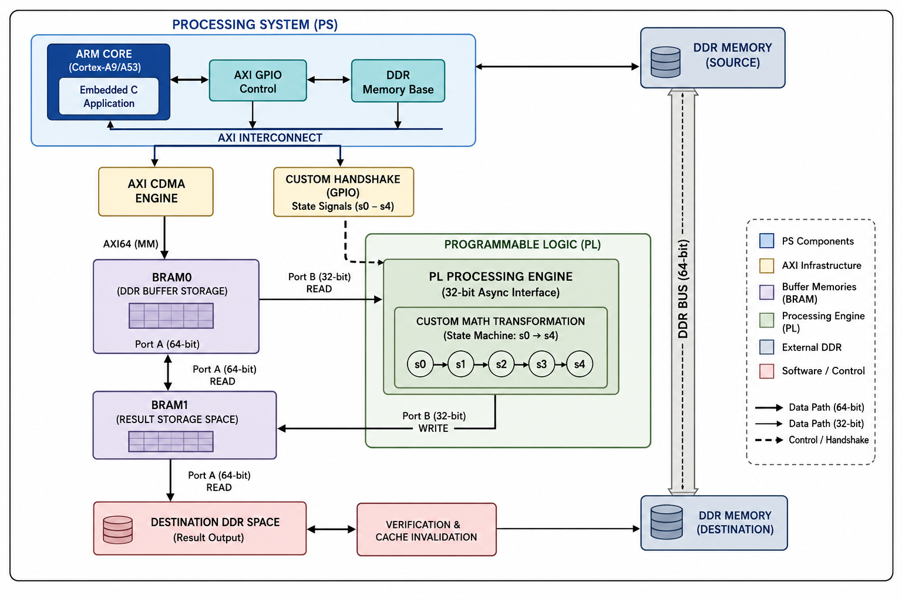

# SoC-Level Virtual Prototyping: High-Performance DDR-to-PL Data Processing Pipeline on Zynq-7000

An end-to-end SoC-level virtual prototyping framework for the Xilinx Zynq-7000 architecture. This project demonstrates a high-throughput DDR-to-PL data processing pipeline using **AXI CDMA**, **dual-port BRAM controllers**, and **custom hardware-software handshaking** — fully verified inside a software co-simulation environment powered by **Renode** and **Verilator**.

---
##  Full Project Download

All RTL source files, simulation results the full project presentation, and reference documentation are packaged together.
**[📁 Download Full Project (Google Drive)](https://drive.google.com/file/d/1ZAVyFyPXAbd8olpM0ASr3neKbUt1IoKs/view?usp=sharing)**


##  System Architecture & Data Flow

The system coordinates memory transfers and hardware acceleration across the Zynq Processing System (PS — ARM Cortex-A9) and Programmable Logic (PL):



---

##  Pipeline Execution Stages

| Stage | Description |
|---|---|
| **1. DDR → BRAM0** | Embedded `.hex` dataset loaded into PS DDR (`0x10000000`) is streamed over 64-bit AXI CDMA into BRAM0 (Port A). |
| **2. PL Processing Engine** | Custom Verilog FSM reads 32-bit entries from BRAM0 (Port B), applies hardware arithmetic operations (`+0x5`), and pipelines modified results into BRAM1 (Port B). |
| **3. BRAM1 → DDR** | Transformed data in BRAM1 (Port A) is transferred back to destination DDR space (`0x10010000`) via CDMA for validation. |
| **Handshaking** | GPIO Channels 1 & 2 handle step-by-step synchronization between the ARM CPU and PL FSM states. |

---

##  Detailed Block-Level Architecture (Vivado IP Integrator)

The Vivado block design implements four distinct planes, each using the most appropriate interconnect for its purpose — this separation keeps AXI protocol overhead off the hot data path.

### 1. Control Plane — AXI4-Lite (PS configures hardware)

```
PS (M_AXI_GP0) → AXI SmartConnect → axi_cdma_0  (S_AXI_LITE)  — configure DMA transfers
                                   → axi_gpio_0   (S_AXI)       — drive/read handshake bits
```

The embedded C application writes CDMA transfer descriptors (source/destination address, length, start bit) and toggles or polls GPIO bits. No bulk data passes through this path.

### 2. Data Plane — AXI4-Full (bulk memory-to-memory transfers)

```
axi_cdma_0 (M_AXI) → AXI Interconnect → M00_AXI → axi_bram_ctrl_0 → blk_mem_gen_0 (BRAM0, Port A)
                                       → M01_AXI → axi_bram_ctrl_1 → blk_mem_gen_1 (BRAM1, Port A)
                                       → M02_AXI → PS (S_AXI_HP0)  → DDR
```

AXI CDMA is the only bus master performing bulk transfers, moving data DDR↔BRAM0 and BRAM1↔DDR through the interconnect to three separate slave targets.

### 3. Direct RTL Access Plane — raw dual-port BRAM (no AXI overhead)

```
blk_mem_gen_0 (Port B) ⟷ PL_DDR_BRAM_v1_0   — reads BRAM0 directly (bram0_addrb, bram0_doutb, bram0_web...)
blk_mem_gen_1 (Port B) ⟷ PL_DDR_BRAM_v1_0   — writes BRAM1 directly (bram1_addrb, bram1_dinb, bram1_web...)
```

Since each Block Memory Generator instance is **true dual-port**, Port A is dedicated to the AXI/CDMA side while Port B connects straight into the custom FSM (`PL_DDR_BRAM_v1_0`). The processing core never has to speak AXI — it accesses memory like a plain register file, eliminating protocol overhead on the compute path.

### 4. Handshake Plane — GPIO-based synchronization

```
axi_gpio_0 GPIO  (5-bit out) → xlslice_0..4 → individual 1-bit control lines into PL_DDR_BRAM_v1_0:
                                                 DDR_BRAM0_W, BRAM0_BRAM1_W, BRAM1_DDR_W,
                                                 BRAM1_DDR_W_com, restar_process_w

PL_DDR_BRAM_v1_0 status outputs → ilconcat_0 (4-bit concat) → axi_gpio_0 GPIO2 (4-bit in) → PS polls status
```

- **Slice blocks (`xlslice_0`–`xlslice_4`)** split the single 5-bit GPIO output bus into individual 1-bit trigger signals the FSM can consume separately.
- **Inline Concat (`ilconcat_0`)** merges four separate 1-bit status flags from the FSM into a single 4-bit bus so the PS can read all status in one GPIO2 register access.

### 5. Clock & Reset Distribution

```
PS FCLK_CLK0      → single clock domain driving every PL block (CDMA, interconnect, GPIO, BRAM controllers, custom FSM)
PS FCLK_RESET0_N  → proc_sys_reset_0 → synchronized resets (peripheral_reset, interconnect_aresetn, bus_struct_reset...)
                                        fanned out to every IP's reset pin
```

### IP Summary Table

| IP Block | Role |
|---|---|
| `processing_system7_0` | Zynq PS — ARM Cortex-A9, runs the embedded application, owns DDR controller |
| `proc_sys_reset_0` | Generates synchronized resets for every clock domain in the PL |
| `axi_cdma_0` | AXI Central DMA — performs DDR↔BRAM0 and BRAM1↔DDR transfers |
| `smartconnect_0` | Routes PS's AXI4-Lite master to CDMA and GPIO control interfaces |
| `axi_interconnect_0` | Routes CDMA's AXI4-Full master to BRAM controllers and the PS HP port |
| `axi_gpio_0` | Dual-channel GPIO — outputs FSM triggers, inputs FSM status flags |
| `axi_bram_ctrl_0` / `axi_bram_ctrl_1` | AXI-to-BRAM bridges, exposing Port A of each memory to the AXI fabric |
| `blk_mem_gen_0` / `blk_mem_gen_1` | True dual-port block RAM — BRAM0 (input buffer) and BRAM1 (result buffer) |
| `xlslice_0`–`xlslice_4` | Split the 5-bit GPIO output bus into individual 1-bit control signals |
| `ilconcat_0` | Merge four 1-bit FSM status flags into a single 4-bit GPIO input bus |
| `PL_DDR_BRAM_v1_0` | Custom RTL — the processing FSM; reads BRAM0 / writes BRAM1 via direct Port B access |

---

## 📁 Repository Structure & File Details

### Complete Archives

- **Google Drive Link (Full Projects):** [Insert Google Drive Link Here]
- `for_Vivado.zip` — Complete Vivado block design (`.bd`), IP configuration parameters, and top-level synthesis source files.
- `for_vitis/` — Platform board support packages (BSP), system project settings, and C application source code.

### Repository Files

| File Name | Description |
|---|---|
| [`CMakeLists.txt`](https://github.com/vijay-2020-vijay/SoC-Level-Virtual-Prototyping-High-Performance-DDR-to-PL-Data-Processing-Pipeline-on-Zynq-7000/blob/main/CMakeLists.txt) | CMake build configuration script for compiling RTL sources with Verilator into a Renode shared library plugin. |
| [`DDR_BRAM_DDR_2_2.elf`](https://github.com/vijay-2020-vijay/SoC-Level-Virtual-Prototyping-High-Performance-DDR-to-PL-Data-Processing-Pipeline-on-Zynq-7000/blob/main/DDR_BRAM_DDR_2_2.elf) | Bare-metal executable compiled via Vitis containing application logic and embedded `.hex` data parser. |
| [`DDR_BRAM_HEX.hex`](https://github.com/vijay-2020-vijay/SoC-Level-Virtual-Prototyping-High-Performance-DDR-to-PL-Data-Processing-Pipeline-on-Zynq-7000/blob/main/DDR_BRAM_HEX.hex) | Raw input dataset containing 630 hex-formatted 64-bit entries embedded into the PS program memory section. |
| [`PL_DDR_BRAM.v`](https://github.com/vijay-2020-vijay/SoC-Level-Virtual-Prototyping-High-Performance-DDR-to-PL-Data-Processing-Pipeline-on-Zynq-7000/blob/main/PL_DDR_BRAM.v) | Core RTL processing module implementing asymmetric BRAM control, state machine logic, and PS-PL handshaking. |
| [`Zynq_DDR_BRAM_wrapper.xsa`](https://github.com/vijay-2020-vijay/SoC-Level-Virtual-Prototyping-High-Performance-DDR-to-PL-Data-Processing-Pipeline-on-Zynq-7000/blob/main/Zynq_DDR_BRAM_wrapper.xsa) | Exported Vivado hardware platform specification containing memory map address definitions and IP metadata. |
| [`sim_main.cpp`](https://github.com/vijay-2020-vijay/SoC-Level-Virtual-Prototyping-High-Performance-DDR-to-PL-Data-Processing-Pipeline-on-Zynq-7000/blob/main/sim_main.cpp) | Verilator C++ simulation testbench wrapper enabling socket bridge communication between RTL and Renode. |
| [`top_axi_wrapper.v`](https://github.com/vijay-2020-vijay/SoC-Level-Virtual-Prototyping-High-Performance-DDR-to-PL-Data-Processing-Pipeline-on-Zynq-7000/blob/main/top_axi_wrapper.v) | Top-level Verilog wrapper interfacing the PL processing core to AXI-Lite and AXI-Full interconnects. |
| [`Zynq_DDR_BRAM_images/`](https://github.com/vijay-2020-vijay/SoC-Level-Virtual-Prototyping-High-Performance-DDR-to-PL-Data-Processing-Pipeline-on-Zynq-7000/tree/main/Zynq_DDR_BRAM_images) | Folder containing experimental execution logs, terminal verification traces, and GTKWave waveform dumps. |

---

##  Prerequisites & Build Tools

| Tool | Purpose |
|---|---|
| **Xilinx Vivado / Vitis** (v2024.2 or compatible) | EDA tools for hardware design and embedded software |
| **Renode Engine Framework** | Virtual platform / co-simulation environment |
| **Verilator** (v4.200+) & **CMake** | HDL verifier / RTL-to-C++ simulation build system |
| **GTKWave** & `vcd2fst` utility | Waveform analysis |

---

##  Execution & Co-Simulation Setup

### 1. Compile Verilator Shared Model

```bash
mkdir build && cd build
cmake ..
make -j$(nproc)
```

### 2. Launch Renode Co-Simulation

```bash
renode project_zynq_DDR_BRAM.resc
```

#### 📜 `project_zynq_DDR_BRAM.resc` — Script Walkthrough

The Renode script boots a virtual Zynq-7000 platform, attaches the Verilator-compiled PL model as a co-simulated peripheral, loads the bare-metal application, and starts execution. Each step is explained below.

| # | Command | Purpose |
|---|---|---|
| 1 | `mach create` | Creates a fresh virtual machine instance in Renode. |
| 2 | `machine LoadPlatformDescription @platforms/boards/zedboard.repl` | Loads the predefined ZedBoard platform (Zynq-7000 PS: ARM Cortex-A9, UART, timers, interrupt controller, default memory map). |
| 3 | `sysbus Unregister memory` | Removes the default memory region from the base platform description, so a custom-sized region can be defined without address conflicts. |
| 4 | `machine LoadPlatformDescriptionFromString 'progRam: Memory.MappedMemory @ sysbus 0x0 { size: 0x10000000 }'` | Defines a 256 MB DDR memory region at address `0x0`, used for application code, stack, and the embedded `.hex` dataset. |
| 5 | `machine LoadPlatformDescriptionFromString 'pl_ddr_bram: CoSimulated.CoSimulatedPeripheral @ sysbus <0x10000000, +0xB2000900> { frequency: 100000000; limitBuffer: 10000; timeout: 240000 }'` | Maps the custom PL processing core (built via Verilator) into the address space at `0x10000000`. Sets PL clock frequency (100 MHz), event buffer limit, and simulation timeout. |
| 6 | `sysbus WriteDoubleWord 0xE0000000 0x14` | Writes to the Zynq SLCR register to configure a clock/reset control bit required before the PS can drive the PL clock domain. |
| 7 | `showAnalyzer sysbus.uart0` | Opens a live terminal window for UART0 output — where the embedded application's debug logs appear. |
| 8 | `sysbus.pl_ddr_bram SimulationFilePathLinux @<path>/libVtop.so` | Links the compiled Verilator shared library (RTL model) to the co-simulated peripheral. |
| 9 | `sysbus LoadELF @<path>/DDR_BRAM_DDR_2_2.elf` | Loads the Vitis-compiled bare-metal ELF into the virtual DDR memory defined in step 4. |
| 10 | `start` | Begins execution — the PS boots, runs the ELF, and drives the PL peripheral via the AXI interconnect. |

**Full script:**

```tcl
# ------------------------------------------------------------------
# 1. Machine Creation
# ------------------------------------------------------------------
mach create

# ------------------------------------------------------------------
# 2. Load Base Platform Description
# ------------------------------------------------------------------
machine LoadPlatformDescription @platforms/boards/zedboard.repl

# ------------------------------------------------------------------
# 3. Remove Default Program Memory
# ------------------------------------------------------------------
sysbus Unregister memory

# ------------------------------------------------------------------
# 4. Redefine Program Memory (DDR)
# ------------------------------------------------------------------
machine LoadPlatformDescriptionFromString 'progRam: Memory.MappedMemory @ sysbus 0x0 { size: 0x10000000 }'

# ------------------------------------------------------------------
# 5. Attach the Co-Simulated PL Peripheral
# ------------------------------------------------------------------
machine LoadPlatformDescriptionFromString 'pl_ddr_bram: CoSimulated.CoSimulatedPeripheral @ sysbus <0x10000000, +0xB2000900> { frequency: 100000000; limitBuffer: 10000; timeout: 240000 }'

# ------------------------------------------------------------------
# 6. Configure Slave Control Register (SLCR)
# ------------------------------------------------------------------
sysbus WriteDoubleWord 0xE0000000 0x14

# ------------------------------------------------------------------
# 7. Enable UART Console Output
# ------------------------------------------------------------------
showAnalyzer sysbus.uart0

# ------------------------------------------------------------------
# 8. Link the Verilator Shared Library
# ------------------------------------------------------------------
# NOTE: Update this path to match your own build output location.
sysbus.pl_ddr_bram SimulationFilePathLinux @/path/to/verilator_build/build/libVtop.so

# ------------------------------------------------------------------
# 9. Load the Bare-Metal Application
# ------------------------------------------------------------------
# NOTE: Update this path to match your own Vitis build output.
sysbus LoadELF @/path/to/DDR_BRAM_DDR_2_2/Debug/DDR_BRAM_DDR_2_2.elf

# ------------------------------------------------------------------
# 10. Start Simulation
# ------------------------------------------------------------------
start
```

> ⚠️ **Note:** Replace the two `@/path/to/...` entries in steps 8 and 9 with the absolute paths on your own machine before running the script.

### 3. Compress & Analyze GTKWave Waveforms

To prevent UI performance bottlenecks on large simulation files, convert raw VCD traces into compressed FST format prior to viewing:

```bash
# Convert raw text VCD (e.g., 4.2GB) to lean binary FST (~1.4MB)
vcd2fst simx.vcd simx.fst

# Launch GTKWave using FST mode
gtkwave simx.fst &
```

---

## 📊 Experimental Results & Verification

This section showcases simulation logs and GTKWave trace outputs demonstrating hardware state transitions and DDR memory transactions.

- **Renode Console Execution Log**
- **GTKWave Signal Verification**

.png)
.png)
.png)
.png)
.png)
.png)
.png)
.png)
.png)
.png)
.png)
.png)
.png)
.png)
.png)
.png)


### Key Verification Highlights

- ✅ **CDMA Transfer Validation** — Confirmed 64-bit transfers from DDR (`0x10000000`) into BRAM0.
- ✅ **PL State Machine Transitions** — Observed continuous execution through state loop (`s0` → `s4`) driven by AXI GPIO pulses.
- ✅ **Data Integrity Check** — Verified transformed data values (`0x...DEADBEEF` / incremented hex strings) stored in DDR target address (`0x10010000`).
